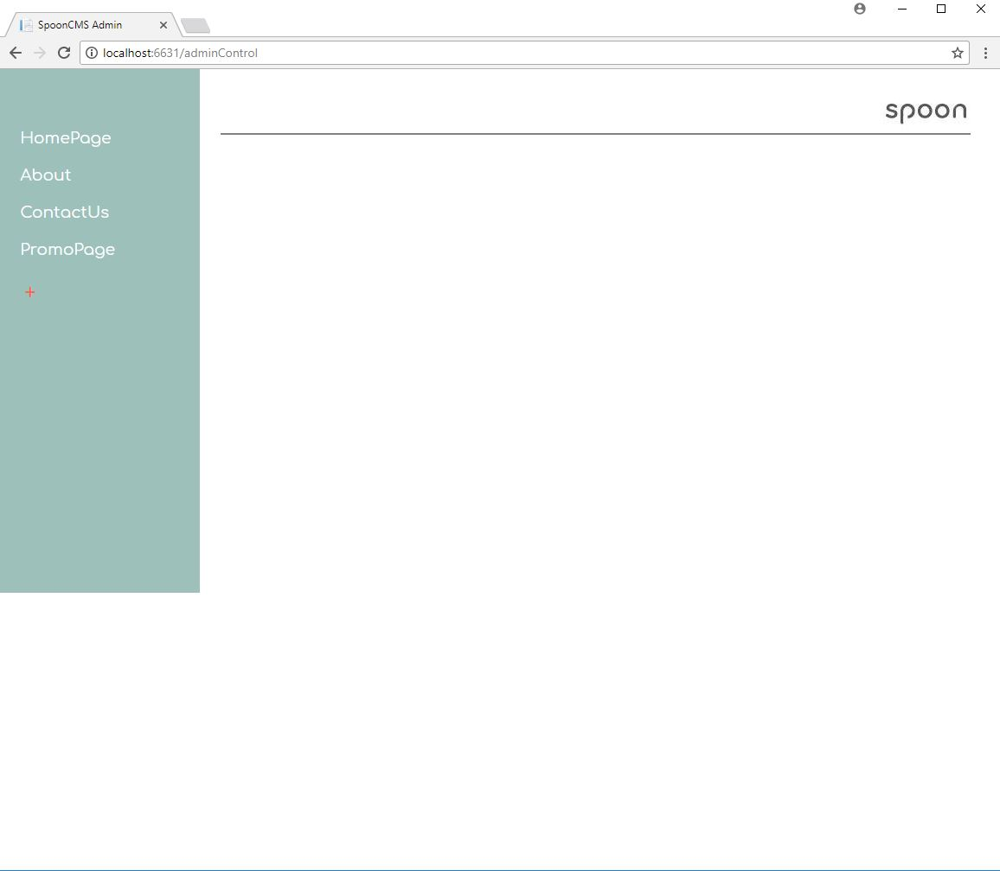
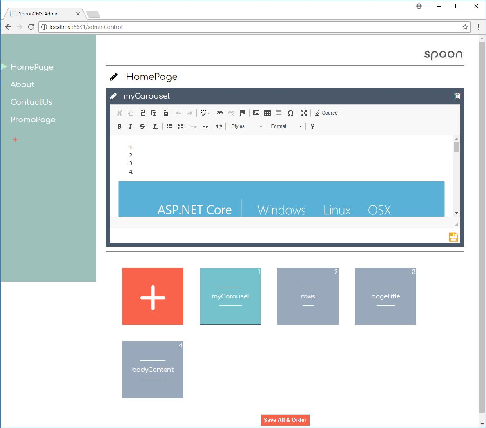
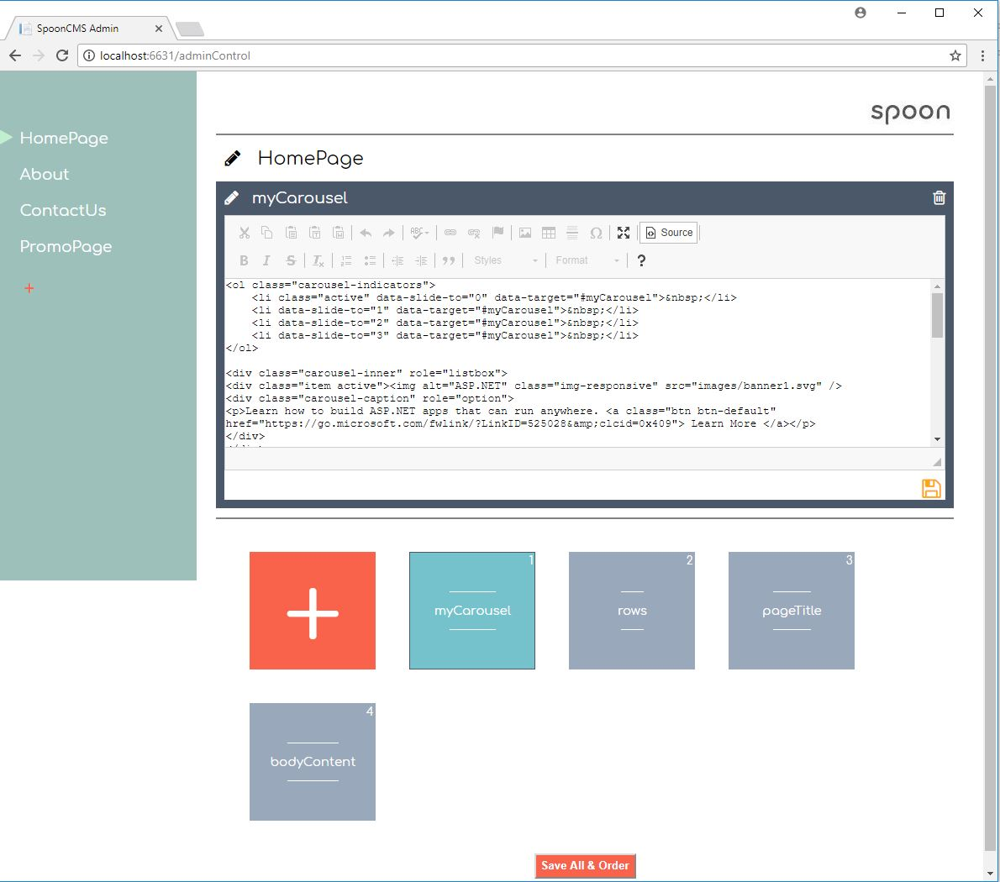

# SpoonCMS
A lightweight .NET core CMS for page content

[](https://www.nuget.org/packages/SpoonCMS/) [](https://gitter.im/BenTMatthews/SpoonCMS?utm_source=badge&utm_medium=badge&utm_campaign=pr-badge&utm_content=badge)


## Why would you use this?
Mostly because you like coding in .Net, but want some flexibility in your content. For the longest time in .Net web dev, if you wanted content management you had to choose between an extremely complex CMS systems that felt like a language/platform unto itself, or deploy updates to html or content files everytime you wanted any update with little exception. So I built a very simple system to manage content (actual content) that did these key things:
- Easy to integrate (less than 10 lines of code for base implementation)
- Simple conceptually (You store HTML, you get HTML out)
- Let's me code in .Net without impediment
- Can use LiteDB or Postgres as a data source

This is the core of what SpoonCMS does: very simple page content management. No routing, no complex auth systems, just managing the markup on your page.

## Getting started
Install the Nuget package: `Install-Package SpoonCMS -Version 1.0.1`
Setup your routes to the admin page and setup the injection of the SpoonData class

```
 public void ConfigureServices(IServiceCollection services)
{
    ...
    string connString = @"Data\DB\";
    ISpoonData spoonData = SpoonWebWorker.GenerateDataWorker(SpoonDBType.LiteDB, connString);
    SpoonWebWorker.AdminPath = "/adminControl";
    SpoonWebWorker.SpoonData = spoonData;

    services.AddSingleton<ISpoonData>(spoonData);
    ...
}

public void Configure(IApplicationBuilder app, IHostingEnvironment env)
{
    ...
   app.Map(SpoonWebWorker.AdminPath, SpoonWebWorker.BuildAdminPageDelegate);  
    ...
}
```

And you now have it installed and can access the admin page at the path you specificy. You will also have a reference to the SpoonData class using dependency injection to access your content like so

```
public class HomeController : Controller
{
    private readonly ISpoonData _spoonData;

    public HomeController(ISpoonData spoonData)
    {
        _spoonData = spoonData;
    }
    public IActionResult Index()
    {
        HomePageViewModel vm = new HomePageViewModel();
        Container con = _spoonData.GetContainer("HomePage");
        vm.rows = con.GetItem("rows").Value;
        vm.carousel = con.GetItem("myCarousel").Value;
        
        ViewData["Title"] = con.GetItem("pageTitle").Value;
        return View(vm);
    }
...
```
## The Admin

The approach for the admin is to be as simple as possible, without the common instituational feel some CMS give off. The example project has example data and will redirect you to the admin on load. Here I have recreated and broke down the sample MVP project that comes with VS. You will see the list of containers you have created on the left:



Once you select a container, the container's content items will show with a list at the bottom and are orderable.



The editor will show the content as an HTML WYSIWYG editor by default, but you can choose to (and commonly recommended) work in the source. Code your markup in your IDE of choice, verify it, then paste it into the admin.



You can save content items individually, or save them all and their order within the container using the "Save All & Order" button. Remember, if you save the order of the items, you are also saving all the `ContentItem` in the container as well.


## Key Concepts

There are really only 2 classes  that you would utilize from code.

The `ContentItem` class is the basis for your content. For the most part, this will store the name name of your Content (For instance: "HeaderContent") and the value of it which would usually be HTML (`<div>This is the Header Content</div>`). ContentItems will be stored in a `Container`, which at it's heart is just a collection of `ContentItem`.

After you have stored content into a container, you would access it like so:
```
_spoonData.GetContainer("ContainerName").GetItem("ContentItemName").Value;
```

Containers are best used to reflect content item collections that will be utilized together. Common use is to have a `Container` reflect a page, and then `ContentItem` that are within it represent those dynamic sections. For instance, loading the homepage using spoon. 

```
Container container = _spoonData.GetContainer("HomePage");
PageViewModel vm = new PageViewModel();

vm.headerContent = container.GetItem("HeaderContent").Value;
vm.bodyCotentBlock = container.GetItem("BodyContentBlock").Value;
vm.rightRail = container.GetItem("RightRailContent").Value;
vm.leftNav = container.GetItem("LeftNavLinks").Value;
vm.footer = container.GetItem("FooterContent").Value;
```

Now you can populate them on the view. Remember to use `@Html.Raw` since the html is stored encoded

```
<body>
    <div id="header-block">@Html.Raw(Model.headerContent)</div>
    <div id="body-copy">@Html.Raw(Model.bodyCotentBlock)</div>
    <div id="right-rail">@Html.Raw(Model.rightRail)</div>
    <div id="left-nav">@Html.Raw(Model.leftNav)</div>
    <div id="footer">@Html.Raw(Model.footer)</div>
</body>
```

#### Securing the admin
There is a claims check that is built in to protect the admin. This just requires that the Auth Claim of the user trying to access the admin matches at least one claim in the `SpoonWebWorker.AuthClaims` collection:

```
public void ConfigureServices(IServiceCollection services)
{
    ISpoonData spoonData = new LiteDBData(@"Data\DB\");
    SpoonWebWorker.AdminPath = "/adminControl";
    SpoonWebWorker.SpoonData = spoonData;

    //Will need to have some sort of user management system for this to work
    SpoonWebWorker.RequireAuth = true;
    SpoonWebWorker.AuthClaims = new List<Claim>() { new Claim(ClaimTypes.Role, "admins"), new Claim(ClaimTypes.Name, "John") };

    services.AddSingleton<ISpoonData>(spoonData);
    services.AddMvc();
}
```
You can also create a controller and endpoint to generate the admin page and and handle the service calls. If you have some special auth attributes you want to use and not something built into claims, you can secure the controller you specify like any other. This changes our `Configure` a bit:

```
public void ConfigureServices(IServiceCollection services)
{
    ISpoonData spoonData = new LiteDBData(@"Data\DB\");
    SpoonWebWorker.AdminPath = "adminControl"; //remove leading '/'
    SpoonWebWorker.SpoonData = spoonData;

    //Will need to have some sort of user management system for this to work
    SpoonWebWorker.RequireAuth = true;
    SpoonWebWorker.AuthClaims = new List<Claim>() { new Claim(ClaimTypes.Role, "admins"), new Claim(ClaimTypes.Name, "John") };

    services.AddSingleton<ISpoonData>(spoonData);
    services.AddMvc();
}

public void Configure(IApplicationBuilder app, IHostingEnvironment env)
    {
        ...
        //Not using the delagate, commented out the line below to use our own controller
        //app.Map(SpoonWebWorker.AdminPath, SpoonWebWorker.BuildAdminPageDelegate);     
        
        //Note that when going to a controller instead of web delegate, you must remove the 
        //leading '/' from the path in ConfigureServices. Get it together and standardize this MS!
        
        app.UseMvc(routes =>
        {
            routes.MapRoute(
                name: "SpoonAdmin",
                template: SpoonWebWorker.AdminPath + "/{*AllValues}",
                defaults: new { controller = "Spoon", action = "Admin" });

            routes.MapRoute(
                name: "default",
                template: "{controller=Home}/{action=Index}/{id?}");
        });
        ...
    }
   
```

And then we can generate a controller to handle admin requests like so with whatever Auth attribute you like:

```
using Microsoft.AspNetCore.Mvc;
using SpoonCMS.Workers;

namespace ExampleCore.Controllers
{
    public class SpoonController : Controller
    {
        [MyFancyAuthorizationAttribute]
        public IActionResult Admin()
        {
            // Me must specify in the second parameter that this is for a controller, so set it to true.
            return Content(SpoonWebWorker.GenerateResponseString(Request.HttpContext, true), "text/html");
        }

    }
}
```

Now we can access our admin page at /admin like before but with the controller instead of the web delegate. It will allow or disallow access based on the auth attribute or scheme you define, like any other controller.

Note that all auth actions you define will be for admin page and api requests for the spoon admin.

#### A LITTLE logic to content - Ordering

Through the admin you can determine ordering, and the highest priority can be determined in admin. This is done calling `Container.GetItem();` without specifying a `ContentItem` name as a parameter. You can order `ContentItem` from highest to lowest as left to right, top to bottom in the admin panel with drag and drop. A scenario for this: 

I could have a `Container` called "ProductPageContent" and include 3 `ContentItem` called "Normal", "GameDay", and "BigSale". You could have "Normal" as top priorty for everyday, change priority to "GameDay" if the local sportsball team is playing, and or make the top priorty `ContentItem` "BigSale" if you are trying to move more product that day. Your markup or code in your app would not have to change, simply call this in your controller

```
ViewData["BodyCopy"] = _spoonData.GetContainer("ProductPageContent").GetItem().Value;
```

and whichever you set as the high priority for that container in the admin will be what is returned.  


## Where is the data stored?

The current 2 options are using [LiteDB](https://github.com/mbdavid/LiteDB) or Postgres using [Marten](https://github.com/jasperfx/marten). When you create the dataworker in startup, you can specify the SpoonDBType, and the connection string for Postgres, or the path for LiteDB. Examples for both can be found in the sample project.

An example using LiteDB:

```
public void ConfigureServices(IServiceCollection services)
{
    ...
    ISpoonData spoonData = new LiteDBData(@"MyFolder\Storage\Spoon");
    ...
}
```

## FAQs
* "What if I user a big enterprise DB for my apps?"
    * Spoon will not interfere with that. The content calls, and Spoon as a whole, are design to not interfere with functionality.
* "Can't I please store it somewhere else?"
    * Adding other storage options is on the roadmap. This is not a high priority currently based on a small amount of user feedback, but other databases that support JSON/document storage are being considered.
* "But I need features like creating routes, custom perms, on the fly templates..."
    * All valid things to want, but Spoon is not built for that. Other larger CMS products like Orchard or Umbraco are great products that are built for large CMS solutions that control the application completely. Thats not the goal of this project.

## Thank You

This project is only possible thanks to others and their hard work:

* [LiteDB](https://github.com/mbdavid/LiteDB)
* [jquery](https://github.com/jquery/jquery)
* [handlebars.js](https://github.com/wycats/handlebars.js/)
* [CKEditor](https://github.com/ckeditor)
* [toastr](https://github.com/CodeSeven/toastr)
* [.NET core](https://github.com/dotnet/core)
* [FontAwesome](https://github.com/FortAwesome/Font-Awesome)
* [Sortable](http://rubaxa.github.io/Sortable/)
* [Marten](https://github.com/jasperfx/marten)


## Release Notes

# 1.0
- Added postgres support
- Updated dependencies
- Improved worker generation
- General cleanup and bug fixes.
